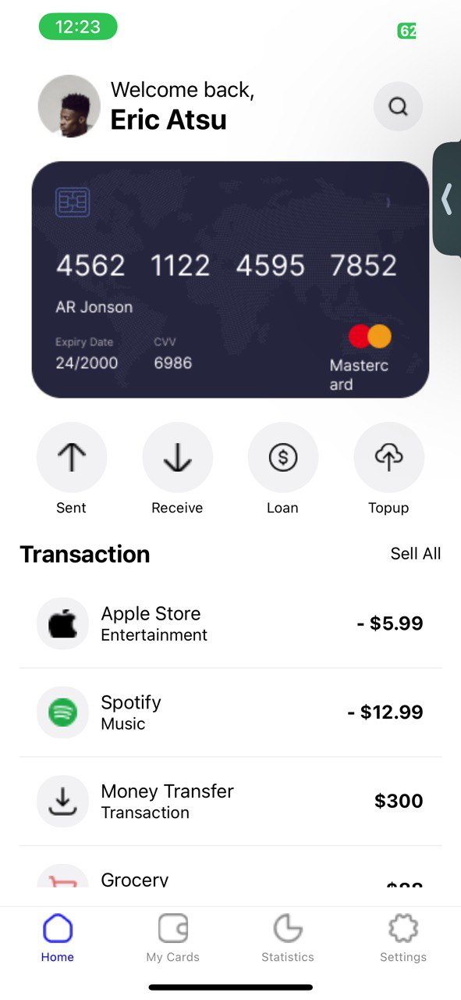
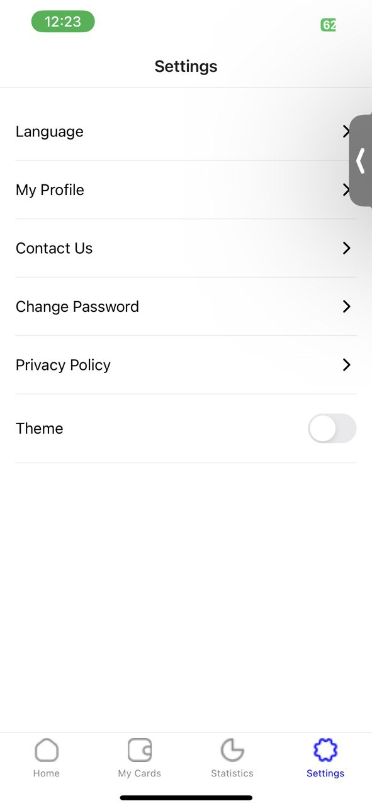
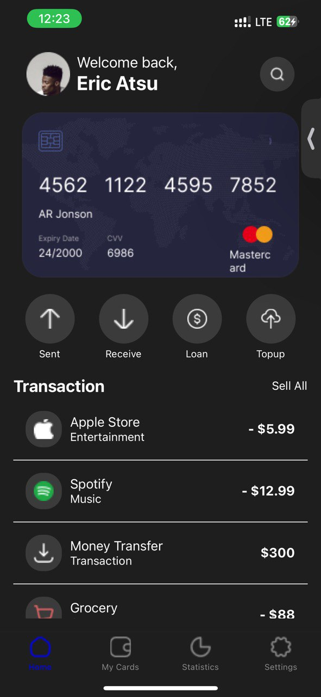
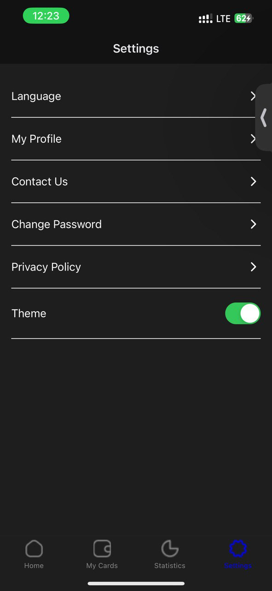

# rn-assignment5-11034645
# Transaction Themed Mobile Application

This application is a themed mobile application built using React Native, designed to manage and view transaction-related information. The app dynamically switches between light and dark themes and features a bottom navigation tab with custom icons and styles.

### Features:

- **Dynamic Theming**: Switch between light and dark themes.
- **Custom Bottom Navigation**: Includes Home, My Cards, Statistics, and Settings tabs with custom icons in the application.
- **Active Tab Highlighting**: Highlights the selected tab icon in blue, regardless of the theme.
- **Consistent Styling**: The app maintains consistent styling and layout across all screens and tabs.
- **Transaction Management**: It helps users manage and view transaction-related information.

### Core Components Used:
- **NavigationContainer**: Manages the navigation tree and state.
- **createBottomTabNavigator**: Creates a bottom tab navigator.
- **Image**: Displays icons for the tabs in the mobile application.
- **themeContext**: Provides theme context to switch between light and dark themes.
- **EventRegister**: Listens for theme change events.

### Additional Dependencies:
- **react-native-gesture-handler**: This dependency enables gesture handling capabilities in the app.
- **@react-navigation/native**: This dependenccy provides navigation container for managing the navigation state.
- **@react-navigation/bottom-tabs**: This dependency enables bottom tab-based navigation.

### Screenshot Of Application:

### Installation:

To run this application locally:

1. Clone this repository.
   
2. Navigate to the project directory and run `npm install` to install dependencies.
   
3. Run `npm start` to start the Metro Bundler.
   
4. Scan the QR code using the Expo Go app on your mobile device or run the application on an emulator.

### Technologies Used:

- React Native
- JavaScript
- react-native-gesture-handler
- @react-navigation/native
- @react-navigation/bottom-tabs
- react-native-event-listeners

## Student ID
11034645

